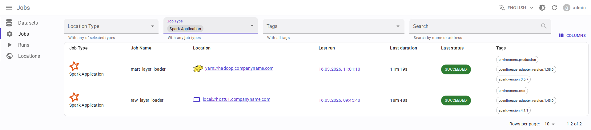
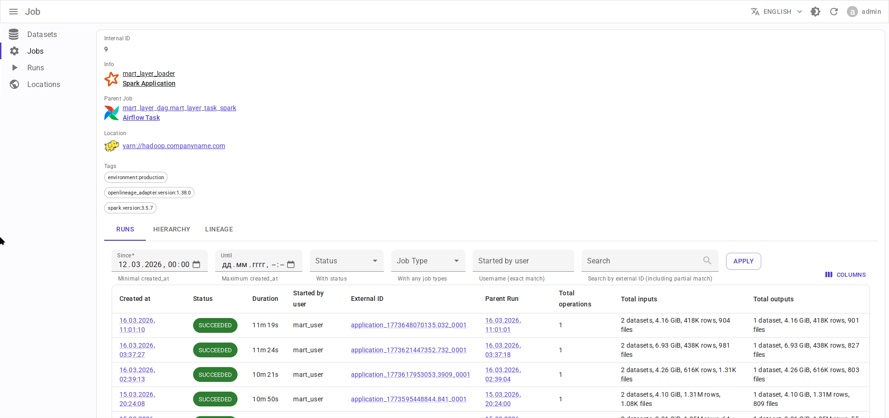
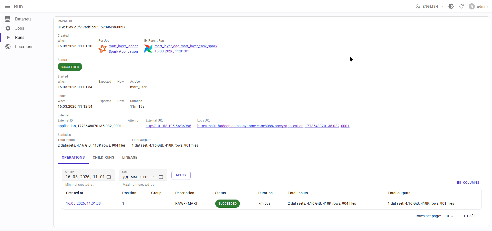
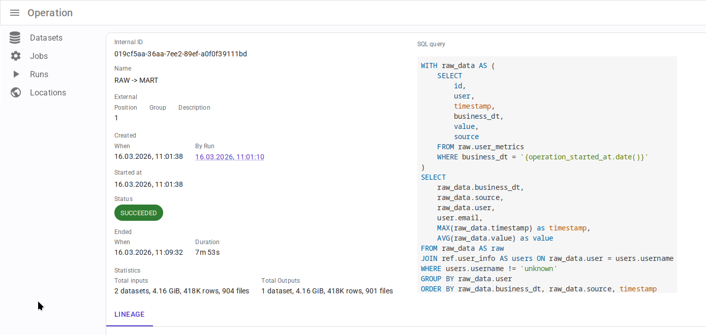
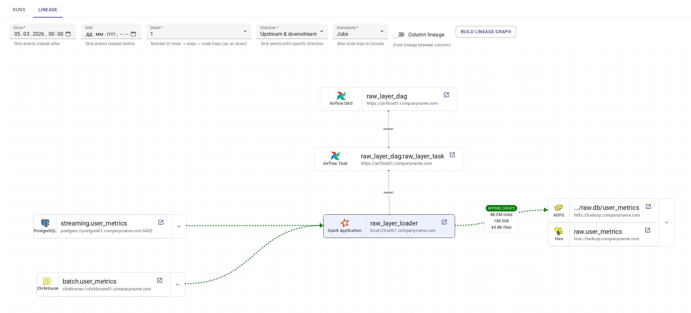
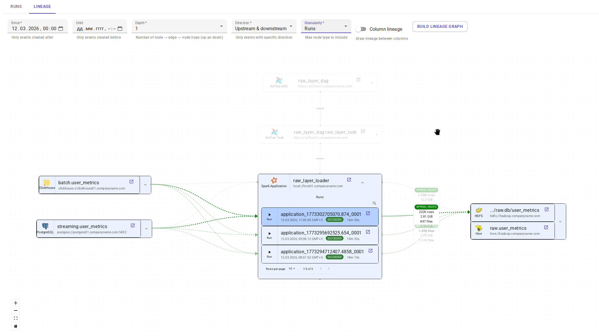
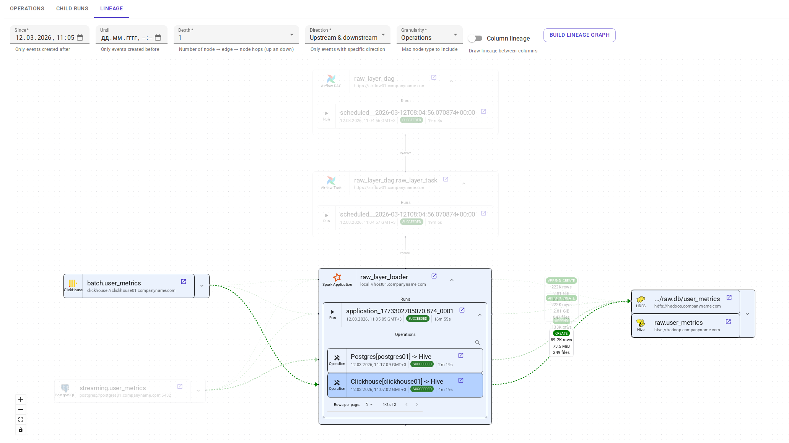
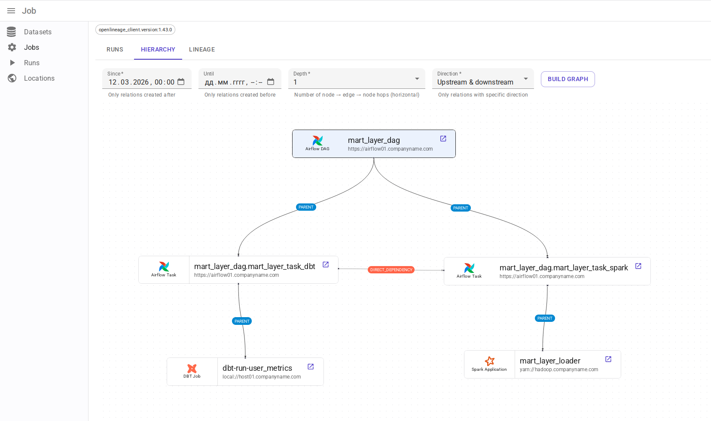

.. _overview-setup-spark:

Apache Spark integration
========================

Using `OpenLineage integration with Apache Spark <https://openlineage.io/docs/integrations/spark/>`_.

Requirements
------------

* `Apache Spark <https://spark.apache.org/>`_ 3.x or higher
* OpenLineage 1.23.0 or higher, recommended 1.40.1+
* Running :ref:`message-broker`
* (Optional) :ref:`http2kafka`

Entity mapping
--------------

* Spark applicationName → Data.Rentgen Job
* Spark applicationId → Data.Rentgen Run
* Spark job, execution, RDD → Data.Rentgen Operation

Setup
-----

Via OpenLineage config file
~~~~~~~~~~~~~~~~~~~~~~~~~~~

* Create ``openlineage.yml`` file with content like:

  .. tabs::

    .. code-tab:: yaml KafkaTransport
      :caption: openlineage.yml

      transport:
          type: kafka
          topicName: input.runs
          properties:
              # should be accessible from Spark driver
              bootstrap.servers: localhost:9093
              security.protocol: SASL_PLAINTEXT
              sasl.mechanism: SCRAM-SHA-256
              sasl.jaas.config: |
                  org.apache.kafka.common.security.scram.ScramLoginModule required
                  username="data_rentgen"
                  password="changeme";
              key.serializer: org.apache.kafka.common.serialization.StringSerializer
              value.serializer: org.apache.kafka.common.serialization.StringSerializer
              compression.type: zstd
              acks: all

    .. code-tab:: yaml HttpTransport (requires HTTP2Kafka)
      :caption: openlineage.yml

      transport:
          type: http
          # http2kafka URL, should be accessible from Spark driver
          url: http://localhost:8002
          endpoint: /v1/openlineage
          compression: gzip
          auth:
              type: api_key
              # create a PersonalToken, and pass it here
              apiKey: personal_token_AAAAAAAAAAAA.BBBBBBBBBBBBBBBBBBBBBBB.CCCCCCCCCCCCCCCCCCCCC

* Pass path to config file via ``OPENLINEAGE_CONFIG`` environment variable:

  .. code:: bash

      OPENLINEAGE_CONFIG=/path/to/openlineage.yml
      # set here location of Spark session, e.g. current host, YARN cluster or K8s cluster:
      OPENLINEAGE_NAMESPACE=local://hostname.as.fqdn
      #OPENLINEAGE_NAMESPACE=yarn://some-cluster
      #OPENLINEAGE_NAMESPACE=k8s://some-cluster

* Setup ``OpenLineageSparkListener`` via SparkSession config:

.. code-block:: python
    :caption: etl.py

    from pyspark.sql import SparkSession

    spark = (
        SparkSession.builder
        # install OpenLineage integration and Kafka client
        .config(
            "spark.jars.packages",
            # For KafkaTransport
            "io.openlineage:openlineage-spark_2.12:1.40.1,org.apache.kafka:kafka-clients:3.9.0",
            # For HttpTransport
            #"io.openlineage:openlineage-spark_2.12:1.40.1",
        )
        .config(
            "spark.extraListeners",
            "io.openlineage.spark.agent.OpenLineageSparkListener",
        )
        # set Spark session master & applicationName
        .master("local")
        .appName("mysession")
        # few other important options
        .config("spark.openlineage.jobName.appendDatasetName", "false")
        .config("spark.openlineage.columnLineage.datasetLineageEnabled", "true")
        .getOrCreate()
    )

Via ``SparkSession`` config
~~~~~~~~~~~~~~~~~~~~~~~~~~~

Add OpenLineage integration package, setup ``OpenLineageSparkListener`` in SparkSession config:

.. tabs::

  .. code-tab:: python KafkaTransport
    :caption: etl.py

    from pyspark.sql import SparkSession

    spark = (
        SparkSession.builder
        # install OpenLineage integration and Kafka client
        .config(
            "spark.jars.packages",
            "io.openlineage:openlineage-spark_2.12:1.40.1,org.apache.kafka:kafka-clients:3.9.0",
        )
        .config(
            "spark.extraListeners", "io.openlineage.spark.agent.OpenLineageSparkListener"
        )
        # set Spark session master & applicationName
        .master("local")
        .appName("mysession")
        # set here location of Spark session, e.g. current host, YARN cluster or K8s cluster:
        .config("spark.openlineage.namespace", "local://hostname.as.fqdn")
        # .config("spark.openlineage.namespace", "yarn://some-cluster")
        # .config("spark.openlineage.namespace", "k8s://some-cluster")
        .config("spark.openlineage.transport.type", "kafka")
        # set here Kafka connection address & credentials
        .config("spark.openlineage.transport.topicName", "input.runs")
        .config(
            # should be accessible from Spark driver
            "spark.openlineage.transport.properties.bootstrap.servers",
            "localhost:9093",
        )
        .config(
            "spark.openlineage.transport.properties.security.protocol",
            "SASL_PLAINTEXT",
        )
        .config(
            "spark.openlineage.transport.properties.sasl.mechanism",
            "SCRAM-SHA-256",
        )
        .config(
            # Kafka auth credentials
            "spark.openlineage.transport.properties.sasl.jaas.config",
            'org.apache.kafka.common.security.scram.ScramLoginModule required username="data_rentgen" password="changeme";',
        )
        .config("spark.openlineage.transport.properties.acks", "all")
        .config(
            "spark.openlineage.transport.properties.key.serializer",
            "org.apache.kafka.common.serialization.StringSerializer",
        )
        .config(
            "spark.openlineage.transport.properties.value.serializer",
            "org.apache.kafka.common.serialization.StringSerializer",
        )
        .config("spark.openlineage.transport.properties.compression.type", "zstd")
        # few other important options
        .config("spark.openlineage.jobName.appendDatasetName", "false")
        .config("spark.openlineage.columnLineage.datasetLineageEnabled", "true")
        .getOrCreate()
    )

  .. code-tab:: python HttpTransport (requires HTTP2Kafka)
    :caption: etl.py

    from pyspark.sql import SparkSession

    spark = (
        SparkSession.builder
        # install OpenLineage integration and Kafka client
        .config(
            "spark.jars.packages",
            "io.openlineage:openlineage-spark_2.12:1.40.1",
        )
        .config(
            "spark.extraListeners", "io.openlineage.spark.agent.OpenLineageSparkListener"
        )
        # set Spark session master & applicationName
        .master("local")
        .appName("mysession")
        # set here location of Spark session, e.g. current host, YARN cluster or K8s cluster:
        .config("spark.openlineage.namespace", "local://hostname.as.fqdn")
        # .config("spark.openlineage.namespace", "yarn://some-cluster")
        # .config("spark.openlineage.namespace", "k8s://some-cluster")
        .config("spark.openlineage.transport.type", "http")
        # http2kafka url, should be accessible from Spark driver
        .config("spark.openlineage.transport.url", "http://localhost:8002")
        .config("spark.openlineage.transport.endpoint", "/v1/openlineage")
        .config("spark.openlineage.transport.compression", "gzip")
        .config("spark.openlineage.transport.auth.type", "api_key")
        .config(
            #Create a PersonalToken, and pass it here
            "spark.openlineage.transport.auth.apiKey",
            "personal_token_AAAAAAAAAAAA.BBBBBBBBBBBBBBBBBBBBBBB.CCCCCCCCCCCCCCCCCCCCC",
        )
        # few other important options
        .config("spark.openlineage.jobName.appendDatasetName", "false")
        .config("spark.openlineage.columnLineage.datasetLineageEnabled", "true")
        .getOrCreate()
    )

Collect and send lineage
------------------------

* Use ``SparkSession`` as context manager, to properly catch session stop events:

.. code-block:: python
    :caption: etl.py

    with SparkSession.builder.getOrCreate() as spark:
        # work with spark inside this context

* Perform some data operations using Spark, like:

.. code-block:: python
    :caption: etl.py

    df = spark.read.format("jdbc").options(...).load()
    df.write.format("csv").save("/output/path")

Lineage will be send to Data.Rentgen automatically by ``OpenLineageSparkListener``.

See results
-----------

Browse frontend page `Jobs <http://localhost:3000/jobs>`_
to see what information was extracted by OpenLineage & DataRentgen.

Job list page
~~~~~~~~~~~~~

Job details page
~~~~~~~~~~~~~~~~

Run details page
~~~~~~~~~~~~~~~~

Operation details page
~~~~~~~~~~~~~~~~~~~~~~

Dataset level lineage
~~~~~~~~~~~~~~~~~~~~~

.. image:: ./dataset_lineage.png

.. image:: ./dataset_column_lineage.png

Job level lineage
~~~~~~~~~~~~~~~~~

Run level lineage
~~~~~~~~~~~~~~~~~

Operation level lineage
~~~~~~~~~~~~~~~~~~~~~~~

Extra configuration
-------------------

Collecting job tags
~~~~~~~~~~~~~~~~~~~

By default, following job tags are created:

- ``spark.version``
- ``openlineage_adapter.version``

It is possible to provide custom job tags using OpenLineage configuration:

.. code-block:: yaml
    :caption: openlineage.yaml

    jobs:
        tags:
            - environment:production
            - layer:bronze

.. code-block:: python
    :caption: etl.py

    SparkSession.builder.config("spark.openlineage.job.tags", "environment:production;layer:bronze")

Binding Airflow Task with Spark application
~~~~~~~~~~~~~~~~~~~~~~~~~~~~~~~~~~~~~~~~~~~

If OpenLineage event contains `Parent Run facet <https://openlineage.io/docs/spec/facets/run-facets/parent_run/>`_,
DataRentgen can use this information to bind Spark application to the run it was triggered by, e.g. Airflow task:

To fill up this facet, it is required to:

* Setup OpenLineage integration for Spark
* Setup :ref:`OpenLineage integration for Airflow <overview-setup-airflow>`
* `Pass parent Run info from Airflow to Spark <https://openlineage.io/docs/integrations/spark/configuration/airflow#preserving-job-hierarchy>`_:

  .. code-block:: python
    :caption: dag.py

    def my_etl(
        parent_job_namespace: str,
        parent_job_name: str,
        parent_run_id: str,
        root_job_namespace: str,
        root_job_name: str,
        root_run_id: str,
    ):
        spark = (
            SparkSession.builder
            # install OpenLineage integration (see above)
            # Pass parent Run info from Airflow to Spark
            .config("spark.openlineage.parentJobNamespace", parent_job_namespace)
            .config("spark.openlineage.parentJobName", parent_job_name)
            .config("spark.openlineage.parentRunId", parent_run_id)
            .config("spark.openlineage.rootJobNamespace", root_job_namespace)
            .config("spark.openlineage.rootJobName", root_job_name)
            .config("spark.openlineage.rootRunId", root_run_id)
            .getOrCreate()
        )

        with spark:
            # actual ETL code

    from airflow.providers.standard.operators.python import PythonOperator

    task = PythonOperator(
        task_id="spark_etl",
        python_callable=my_etl,
        # Using Jinja templates to pass Airflow macros to Python function
        op_kwargs={
            "parent_job_namespace": "{{ macros.OpenLineageProviderPlugin.lineage_job_namespace() }}",
            "parent_job_name": "{{ macros.OpenLineageProviderPlugin.lineage_job_name(task_instance) }}",
            "parent_run_id": "{{ macros.OpenLineageProviderPlugin.lineage_run_id(task_instance) }}",
            # For apache-airflow-providers-openlineage 2.4.0 or above
            "root_job_namespace": "{{ macros.OpenLineageProviderPlugin.lineage_root_job_namespace(task_instance) }}",
            "root_job_name": "{{ macros.OpenLineageProviderPlugin.lineage_root_job_name(task_instance) }}",
            "root_run_id": "{{ macros.OpenLineageProviderPlugin.lineage_root_run_id(task_instance) }}",
        },
    )

  The exact way of substituting Airflow macros to SparkSession config may be different depending on used Airflow operator:
    * PythonOperator - via kwargs & `Airflow macros <https://airflow.apache.org/docs/apache-airflow-providers-openlineage/stable/macros.html#lineage-job-run-macros>`_:
    * BashOperator, SSHOperator, KubernetesPodOperator - via environment variables & Airflow macros
    * SparkSubmitOperator - via `spark_inject_parent_job_info=true in airflow.conf <https://openlineage.io/docs/integrations/spark/configuration/airflow#automatic-injection>`_
