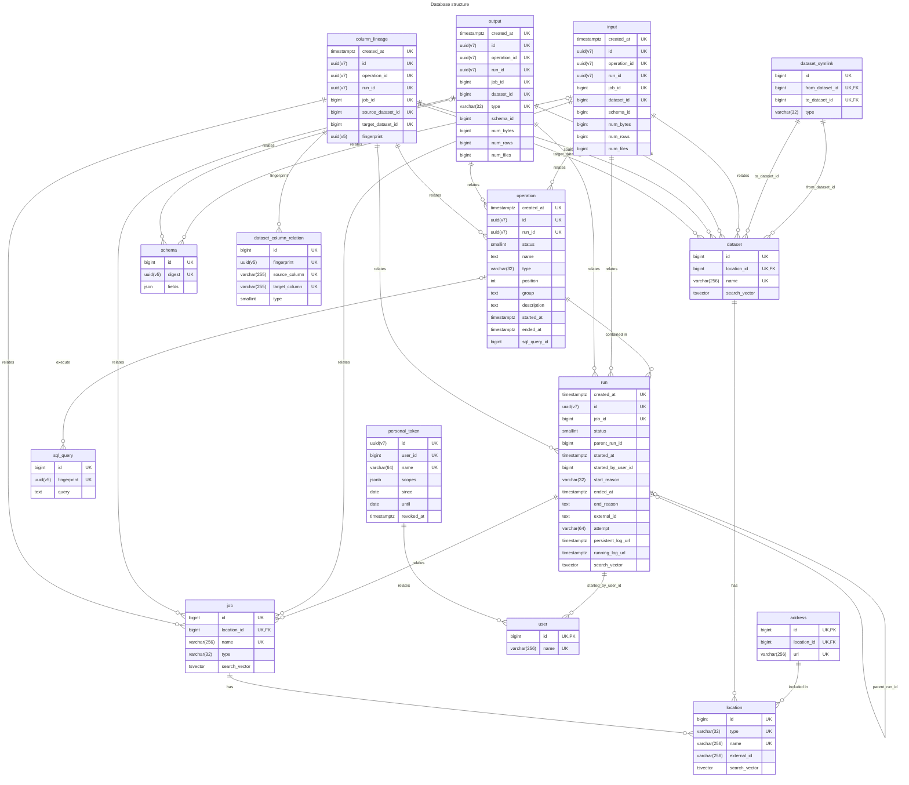

# Database structure { #database-structure }

```mermaid
---
title: Database structure
---

erDiagram

    address {
        bigint id UK, PK
        bigint location_id UK, FK  
        varchar(256) url UK
    }

    location {
        bigint id UK
        varchar(32) type  UK
        varchar(256) name UK 
        varchar(256) external_id
        tsvector search_vector
    }

    user {
        bigint id UK, PK 
        varchar(256) name UK 
    }
   dataset {
        bigint id UK
        bigint location_id  UK, FK
        varchar(256) name UK
        tsvector search_vector
    }

    dataset_symlink {
        bigint id UK
        bigint from_dataset_id  UK, FK
        bigint to_dataset_id  UK, FK
        varchar(32) type
    }

    job {
        bigint id UK
        bigint location_id  UK, FK
        varchar(256) name UK
        varchar(32) type
        tsvector search_vector
    }

    run {
        timestamptz created_at UK
        uuid(v7) id UK
        bigint job_id UK
        smallint status
        bigint parent_run_id
        timestamptz started_at
        bigint started_by_user_id
        varchar(32) start_reason
        timestamptz ended_at
        text end_reason
        text external_id
        varchar(64) attempt
        timestamptz persistent_log_url
        timestamptz running_log_url
        tsvector search_vector
    }

    sql_query {
        bigint id UK
        uuid(v5) fingerprint UK
        text query
    }

    operation {
        timestamptz created_at UK
        uuid(v7) id UK
        uuid(v7) run_id UK
        smallint status
        text name
        varchar(32) type
        int position
        text group
        text description
        timestamptz started_at
        timestamptz ended_at
        bigint sql_query_id
    }

    schema {
        bigint id UK
        uuid(v5) digest UK
        json fields
    }

    input {
        timestamptz created_at UK
        uuid(v7) id UK
        uuid(v7) operation_id UK
        uuid(v7) run_id UK
        bigint job_id UK
        bigint dataset_id UK
        bigint schema_id
        bigint num_bytes
        bigint num_rows
        bigint num_files
    }

    output {
        timestamptz created_at UK
        uuid(v7) id UK
        uuid(v7) operation_id UK
        uuid(v7) run_id UK
        bigint job_id UK
        bigint dataset_id UK
        varchar(32) type UK
        bigint schema_id
        bigint num_bytes
        bigint num_rows
        bigint num_files
    }

    dataset_column_relation {
        bigint id UK
        uuid(v5) fingerprint UK
        varchar(255) source_column UK
        varchar(255) target_column UK
        smallint type
    }

    column_lineage {
        timestamptz created_at UK
        uuid(v7) id UK
        uuid(v7) operation_id UK
        uuid(v7) run_id UK
        bigint job_id UK
        bigint source_dataset_id UK
        bigint target_dataset_id UK
        uuid(v5) fingerprint
    }

    personal_token {
        uuid(v7) id UK
        bigint user_id UK
        varchar(64) name UK
        jsonb scopes
        date since
        date until
        timestamptz revoked_at
    }


    address ||--o{ location: "included in"
    dataset ||--o{ location: has
    job ||--o{ location: has

    dataset_symlink ||--o{ dataset: "from_dataset_id"
    dataset_symlink ||--o{ dataset: "to_dataset_id"

    run ||--o{ job: relates
    run ||--o{ user: "started_by_user_id"
    run |o--o{ run: "parent_run_id"

    operation ||--o{ run: "contained in"
    operation |o--o{ sql_query: "execute"

    input ||--o{ operation: relates
    input ||--o{ run: relates
    input ||--o{ job: relates
    input ||--o{ dataset: relates
    input |o--o{ schema: relates

    output ||--o{ operation: relates
    output ||--o{ run: relates
    output ||--o{ job: relates
    output ||--o{ dataset: relates
    output |o--o{ schema: relates

    column_lineage ||--o{ operation: relates
    column_lineage ||--o{ run: relates
    column_lineage ||--o{ job: relates
    column_lineage ||--o{ dataset: "source_dataset_id"
    column_lineage ||--o{ dataset: "target_dataset_id"
    column_lineage ||--o{ dataset_column_relation: "fingerprint"

    personal_token ||--o{ user: relates
```
