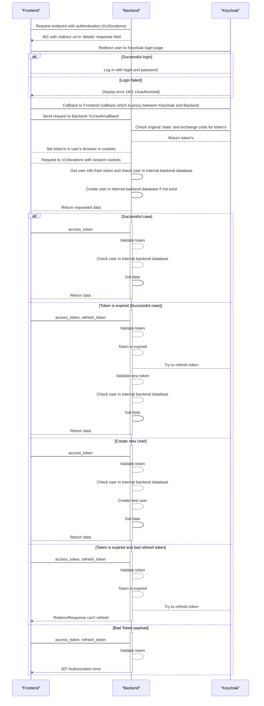

# Keycloak Provider { #auth-server-keycloak }

## Description

Keycloak auth provider uses [python-keycloak](https://pypi.org/project/python-keycloak/) library to interact with Keycloak server. During the authentication process,
KeycloakAuthProvider redirects user to Keycloak authentication page.

After successful authentication, Keycloak redirects user back to Data.Rentgen with authorization code.
Then KeycloakAuthProvider exchanges authorization code for an access token and uses it to get user information from Keycloak server.
If user is not found in Data.Rentgen database, KeycloakAuthProvider creates it. Finally, KeycloakAuthProvider returns user with access token.

## Interaction schema

## Basic Configuration

::: data_rentgen.server.settings.auth.keycloak.KeycloakAuthProviderSettings

::: data_rentgen.server.settings.auth.keycloak.KeycloakSettings
