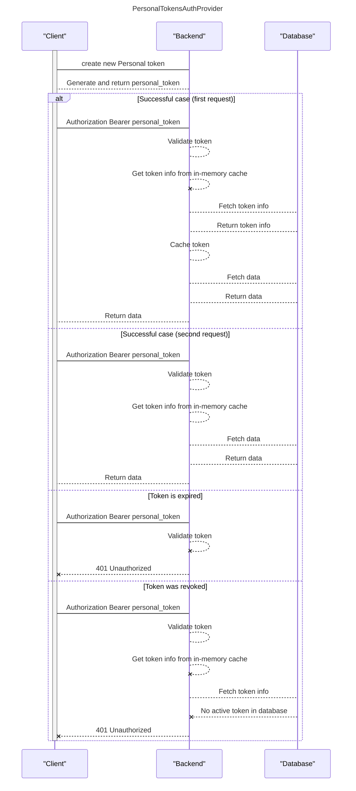

# Personal Tokens { #auth-server-personal-tokens }

## Description

This auth schema (not actually a AuthProvider) allows to access API endpoints using [personal-tokens][personal-tokens].
If enabled, it has higher priority than AuthProvider.

!!! note
    Some endpoints, like creating/refreshing Personal Tokens, cannot be used with this auth type, as they require human interaction.

## Interaction schema

## Basic Configuration

::: data_rentgen.server.settings.auth.personal_token.PersonalTokenSettings
